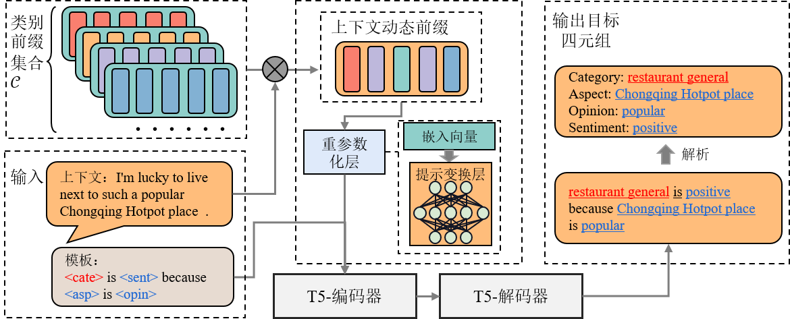
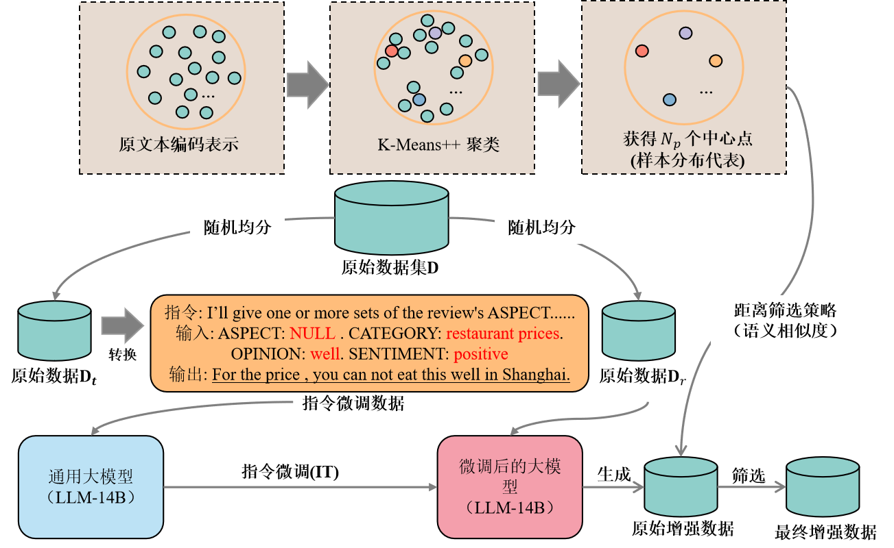

# Dynamic Prefix-Tuning and Data Augmentation for Aspect-Category-Opinion-Sentiment Quadruple Extraction

## **Requirements**

Please note that some packages (such as transformers) are under highly active development. so we highly recommend you install it directly with the command:

```bash
pip install -r requirements.txt
```


## The overall model architecture is as follows:




## Training procedure

### Training a generative model for the basis of sentiment quadruple extraction

```shell
current_dataset=rest16
# You can change CUDA_VISIBLE_DEVICES to suit your device 
CUDA_VISIBLE_DEVICES=0 python main.py \
--dataset $current_dataset \
--use_sent_flag \
--use_prompt_flag \
--use_augmentation \
--token_length 128 \
--n_gpu 0 \
--do_train \
--do_direct_eval \
--max_seq_length 256 \
--E_I ALL \
--train_batch_size 16 \
--gradient_accumulation_steps 1 \
--eval_batch_size 16  \
--learning_rate 1e-4 \
--num_train_epochs 20 
```

We strongly recommend running the **run.sh** file directly for this step.

After the training is complete, you can find a list of the models that have been fine-tuned in . /outputs/{current_dataset} to discover that the T5 model that has been fine-tuned is stored.

### Training prefixes for each category

```shell
current_dataset=rest16
cluster=30
# You can change CUDA_VISIBLE_DEVICES to suit your device 
for MYCAT in $(seq 0 $((MYNUM-1))); do
        CUDA_VISIBLE_DEVICES=0 python main.py \
        --dataset $current_dataset \
        --use_sent_flag \
        --use_prompt_flag \
        --use_augmentation \
        --prefix_tuning \
        --cate_type "$MYCAT" \
        --num_clusters $cluster \
        --token_length 80 \
        --n_gpu 0 \
        --do_train \
        --max_seq_length 256 \
        --E_I ALL \
        --train_batch_size 32 \
        --gradient_accumulation_steps 1 \
        --eval_batch_size 32  \
        --learning_rate 1e-4 \
        --num_train_epochs 20
done
```

We strongly recommend running the **run_prefix.sh** file directly for this step, noting that you can set the number of categories you want to **$cluster** according to your preferences.

Once the training is complete, you can find a list of trained category prefixes in . /outputs_adapter/{current_dataset} to find the prefixes that store the categories that have been trained.

### Load all the category prefixes with the base model and continue to fine-tune

```shell
cluster=30
current_dataset=rest16
# You can change CUDA_VISIBLE_DEVICES to suit your device 
CUDA_VISIBLE_DEVICES=0 python main.py \
--dataset $current_dataset \
--use_sent_flag \
--use_prompt_flag \
--use_augmentation \
--prefix_tuning \
--dynamic \
--num_clusters $cluster \
--token_length 80 \
--n_gpu 0 \
--do_train \
--do_direct_eval \
--max_seq_length 256 \
--E_I ALL \
--train_batch_size 32 \
--gradient_accumulation_steps 1 \
--eval_batch_size 32  \
--learning_rate 1e-4 \
--num_train_epochs 20
```

After the training is complete, you can in see the final model results.

## Additional matters

- The use_augmentation hyperparameter is used to determine if data augmentation is used.

- For more information on setting hyperparameters, please see each help message in main.py->init_args().

- The data enhancement details are in . /data/acos/laptop14/data_augmentation_clear.tsv or . /data/acos/rest16/data_augmentation_clear.tsv

- We open-sourced our augmented data, which was augmented with the following process:

  

